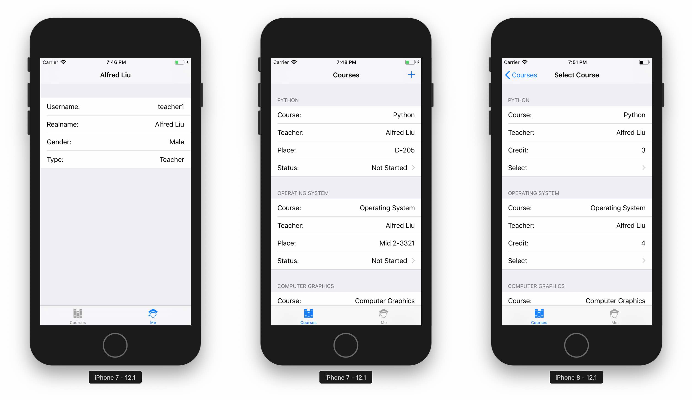
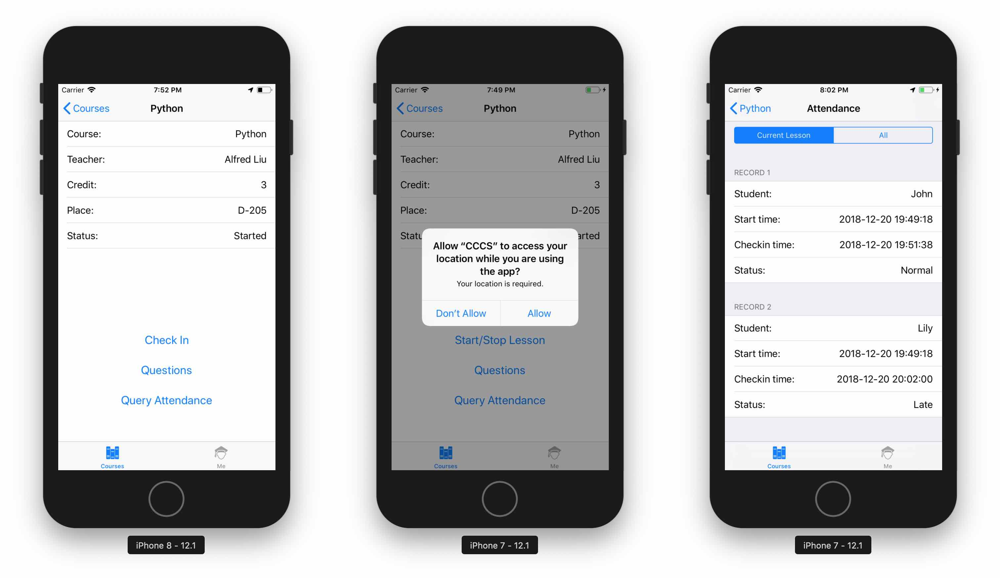
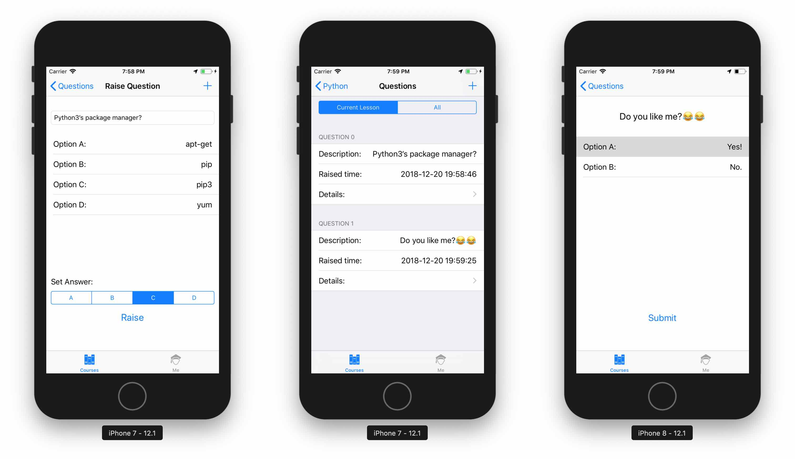

# College Class Check-in System

基于指纹识别（面容识别）与 GPS 定位的课堂考勤系统。

## 硬件要求

* 一台拥有 HTTP + PHP + MySQL 运行环境的服务器
* 一台拥有 Xcode 10.0+ 和 iOS 开发环境的 Mac
* 一台拥有 Touch ID（或 Face ID）和 GPS 功能的 iPhone 手机（iOS 10.0+）

## 特点

* 支持两种账户类型：**老师**和**学生**
* 支持用户的注册、登录，以及个人信息的查看
* 支持老师添加课程、学生选课，以及课表查询
* 弹性的上课和下课时间（由老师控制上下课）
* 使用 GPS + Touch ID / Face ID 来保证身份验证的准确性
* 支持老师随堂提问（仅限 2~4 个选项的选择题）
* 支持查询历史考勤记录

## 缺点

由于作者的水平和时间有限，本项目：

* 在安全性上存在很多漏洞，包括 SQL 注入、密码暴力破解等
* 界面不够美观
* 代码编写较为臃肿，且可能存在很多不当之处

因此本项目仅提供一个针对大学考勤机制的改进思路及其基本实现，并不是可以直接应用部署的一套系统。

当然，如果您对这个项目感兴趣，并希望能改进它，我欢迎您提出 Pull Request。

## 截图

### 个人信息、课表和选课



### 课程主页（学生视角）和考勤查询



### 提问、问题列表和问题提交



## 逻辑

### 签到

在老师点击 `Start Lesson` 开始上课之后，系统会记录下当前的时间和老师的 GPS 坐标。

签到时，学生需要通过指纹或面容认证，并距离老师在一定范围以内（该参数可在 `config.php` 中自行设定，默认 100m）。

学生需要在一定时间内（该参数可在 `config.php` 中自行设定，默认 10min）完成签到，否则将被记为迟到（Late）。

### 提问

老师在上课过程中可以在 `Questions` 页面进行提问（仅限 2~4 个选项的选择题），系统会记录下提问的时间。

回答问题时，学生需要通过指纹或面容认证，并距离老师在一定范围以内（和签到时的距离参数一致）。

学生需要在一定时间内（该参数可在 `config.php` 中自行设定，默认 5min）回答问题（无论正确与否），否则将被记为早退（Leave Early）。

对于既迟到又早退的学生，系统将记录为迟到。对于没有签过到的学生，系统将记录其缺勤。

## 配置

本系统分为服务端和客户端两部分，服务端由 PHP 编写，客户端由 Swift 编写。

### 服务端路径配置

服务端所有代码均在 `server` 目录下。你首先需要将 MySQL 的服务器位置、用户名、密码写入 `config.php` 中，然后将 `server` 目录下所有的 PHP 代码放到服务器的 Web 目录下（例如 `http://domain.com/cccs`），并保证外界可以正常访问。

### MySQL 建库

建库脚本已准备好，只要你在 `config.php` 中配置正确，脚本将为你创建好数据库和所有的数据表。

在浏览器中直接访问 `http://domain.com/cccs/setup.php` 即可完成数据库建库，如果一切顺利，你应该会看到以下输出：

```
Successfully connected to MySQL.
Create new database 'cccs'...
Successfully connected to database 'cccs'.
Checking tables....
Table 'Student' created successfully.
Table 'Teacher' created successfully.
Table 'Course' created successfully.
Table 'Lesson' created successfully.
Table 'Question' created successfully.
Table 'StudentCourse' created successfully.
Table 'StudentLesson' created successfully.
Table 'StudentQuestion' created successfully.
Everything works fine.
```

### 客户端路径配置

客户端所有代码均在 `client/CCCS` 目录下。在 `customDataStructure.swift` 中找到 `serverDir` 变量，并填入服务端路径地址（例如 `http://domain.com/cccs`）即可。

如果你的路径配置不正确，客户端会在启动时报出错误信息。

## 文档

软件需求分析：[requirements-specification.pdf](requirements-specification.pdf)

软件设计分析：[design-specification.pdf](design-specification.pdf)

服务端代码说明：[server-doc.md](server-doc.md)

客户端代码说明：[client-doc.md](client-doc.md)
