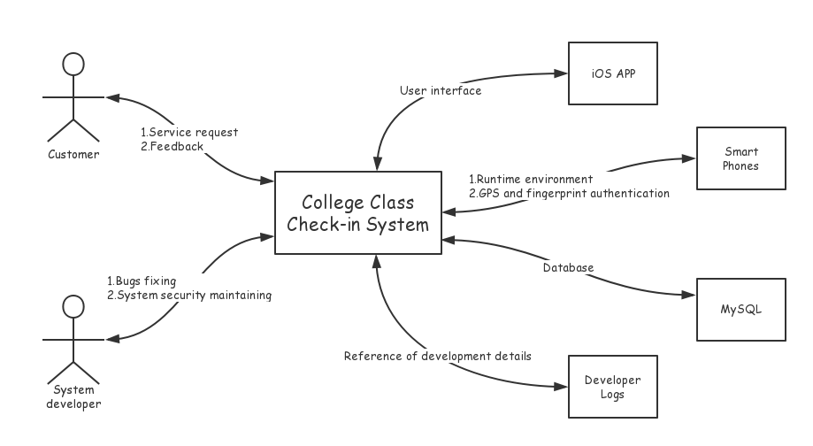
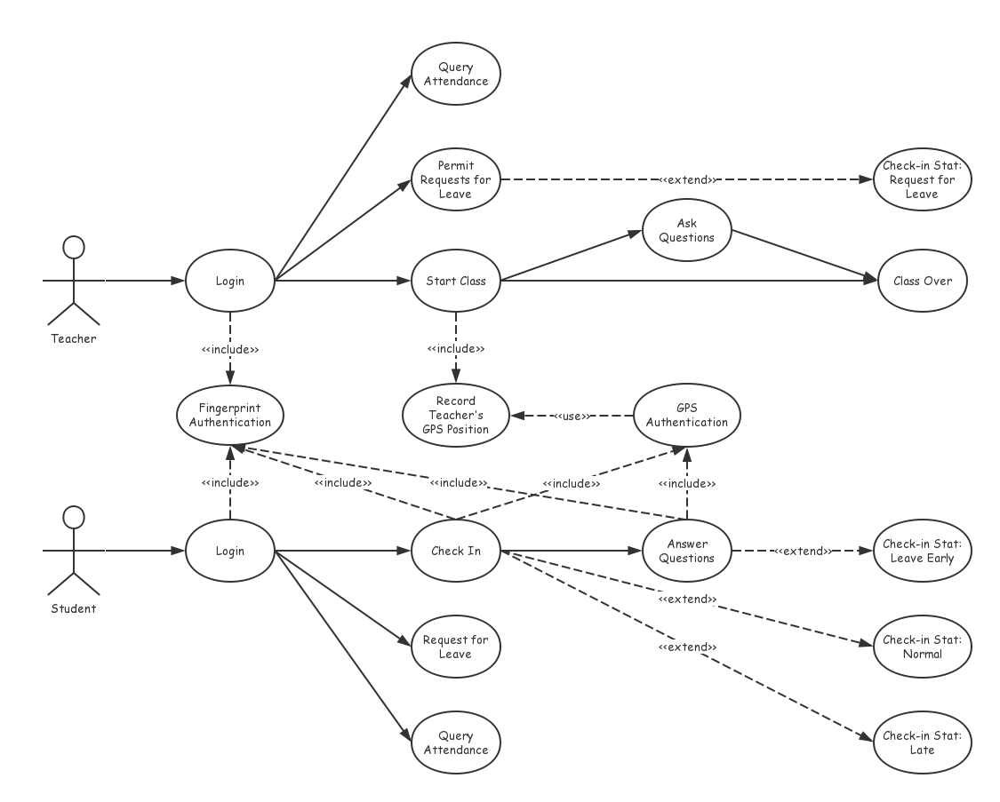

# College Class Check-in System
# Software Requirements Specification
## Version 1.0

Development Team: CCCS

|         Name       | Class | Student ID | Self Evaluation |
|--------------------|-------|------------|-----------------|
|刘海松(Alfred Liu)   | CS-52 | 2150500044 | 100             |
|浦清风(Breeze Pu)    | CS-52 | 2150500047 | 85              |
|姬涛(Tao Ji)         | CS-52 | 2150500040 | 90              |
|张逸翀(Yichong Zhang)| CS-52 | 2150500034 | 85              |

# Revision History

| Date | Version |        Description      | Author        |
|------|---------|-------------------------|---------------|
| 2018/4/22 | 1.0 | Write part of this doc | Alfred Liu    |
| 2018/4/28 | 1.1 | Write part of this doc | Tao Ji        |
| 2018/4/29 | 1.1 | Write part of this doc | Breeze Pu     |
| 2018/4/29 | 1.2 | Write part of this doc | Yichong Zhang |
| 2018/4/30 | 1.4 | Final review           | Alfred Liu    |

# Software Requirements Specification

## 1. Introduction

The College Class Check-in System (CCCS) is used to monitor students’ attendance in college classes. It uses modern technologies such as GPS and fingerprint authentication to guarantee the accuracy and efficiency. With such system, students who are absent could be traced and the attendance rate could be improved greatly.

### 1.1 Purpose

The purpose of College Class Check-in System is to monitor students’ attendance and make it convenient for teachers to manage the class.

### 1.2 Functions

The College Class Check-in System can:

* Ensure the attendance
* Provide utilities for classroom questioning
* Support teaching evaluation
* Support requests for leave

### 1.3 Performance

The client is required to have a two-second response time to all button presses.

The server is required to support more than 500 simultaneous client sessions with the same response time.

### 1.4 Context

### 1.5 Oriented Users

CCCS is oriented for college teachers and students.

### 1.6 Developers

|        Name       | Class | Student ID |
|-------------------|-------|------------|
| 刘海松(Alfred Liu) | CS-52 | 2150500044 |
| 浦清风(Breeze Pu)  | CS-52 | 2150500047 |

### 1.7 Privacy

This docuement can only be viewed by internal team members of CCCS.

### 1.8 Baseline

Basically, the system should be able to deal with the check-in process. Four basic check-in status should be supported: `Normal`, `Late`, `Absent` and `Request for Leave`. Students or teachers should be able to view their or their students' recent attendance.

Other functions and performance requirements are additional.

## 2. References

This ducument has no references.

## 3. Functional Requirements

### 3.1 Overview

#### 3.1.1 Purpose

The purpose has been discussed in section 1.1.

#### 3.1.2 Runtime Environment 

Client: a 64-bit app running on iOS 11

Server: 1 * Intel(R) Xeon(R) CPU E5-26xx v4, 2GB RAM, 50GB Disk, 200Mbps Network, Ubuntu 16.04 LTS x86-64.

#### 3.1.3 User Characteristics

Users can be divided into two parts: college teachers who want a high attendance rate, and most college students who try to skip classes by all means.

#### 3.1.4 Key Point

The key lies on **identification**.

#### 3.1.5 Constraints

All the students must have at least one iPhone with GPS and fingerprint authentication.

All the mobile phones must not run out of battery during the class.

A stable Internet connection is always required during the class.

### 3.2 Overall Requirements

### 3.3 Specification for use cases 

### 3.3.1 Register & Login

The general login process requires your username and password. In our system, fingerprint authentication is also required to enhance security. 

### 3.3.2 Start Class (Only for teachers)

If the teacher wants to start a class, his position will be recorded.

### 3.3.3 Check-in (Only for students)

After the class starts, students can check-in successfully **only when his fingerprint is valid and the distance between him and his teacher is less than 50m**.

The status of check-in will be set to `Normal` if the student successfully checks in within 10 minutes. Otherwise, the status will be set to `Late`. The default is `Absent`.

### 3.3.4 Ask Questions (Only for teachers)

Teachers can ask questions during the class if they want.

### 3.3.5 Answer Questions (Only for students)

If a question is raised, all the students should submit an answer in **5 minutes**. Both fingerprint authentication and GPS are required for identification. The status of check-in will be set to `Leave early` if the student does not submit in time or is too far away from his teacher (more than 50m).

### 3.3.6 Request for Leave

Students can request for leave **before a class starts**. If the request is permited by his teacher, the status of check-in will be set to `Request for Leave`.

### 3.3.7 Query attendance

Students can view their own attendance recently. Teachers can view all his students' attendance. 

## 4. Non-functional Requirements

### 4.1 Performance Indicators

The performance indicators include:

* The response time of client and server
* The amount of simultaneous client sessions

### 4.2 Quality Requirements

The quality requirements include usability requirements, reliability requirements and security requirements.

#### 4.2.1 Usability Requirements

The usability requirements include:

* User interface (including gestures)
* Utilities for query and statistics
* Online help and documention

#### 4.2.2 Reliability Requirements

If GPS is not available, Bluetooth could serve as an alternative.

If Wi-Fi is not stable or available, cellular network could server as an alternative.

#### 4.2.3 Secuity Requirements

Mobile client must be password protected, and fingerprint authentication is also required.

Secure HTTP is required for communication between client and server.

User passwords are encrypted and stored in a MySQL Server.

### 4.3 Environment Requirements

The environment requirements include the requirements of software and hardware resourses for developments, along with the communication requirements.

#### 4.3.1 Software & hardware resources

|             Name              |            OS           |      Addition       |
|-------------------------------|-------------------------|---------------------|
| MacBook Pro (Retina, 13-inch) | macOS 10.13.4           | Xcode 9.3           |
| Tencent CVM                   | Ubuntu 16.04 LTS x86-64 | MySQL, Apache2, PHP |
| iPhone 7 Plus                 | iOS 11.3                | N/A                 |
| iPhone 7                      | iOS 11.3                | N/A                 |
| iPhone 6                      | iOS 11.3                | N/A                 |

#### 4.3.2 Communication

A fast and stable Internet access is required.

A Lightning-to-USB cable is required.

### 4.4 Constraints for design and implementation

#### 4.4.1 Runtime Requirements

The runtime requirements (environment) have been discussed in section 3.1.2.

#### 4.4.2 Programming Language

* Swift
* C++
* SQL

#### 4.4.3 Recovery Processing

If the client crashes, restart the client.

If the server crashes, restart the server.

If the client fails to connect to Internet, contact your ISP.

If the client fails to use GPS or Bluetooth service, contact Apple Customer Service.

If the server fails to connnect to Internet, contact Tencent Cloud Customer Service.

## 5. Priorities of requirements

|                  Name                  |           Type           | Priority |
|----------------------------------------|--------------------------|----------|
| Core functions of check-in             | Functional Requirement   | High     |
| HTTPS for communication                | Security Requirement     | High     |
| Alternative methods for identification | Reliability Requirements | Middle   |
| Classroom questioning                  | Functional Requirement   | Middle   |
| UI, online help, other utilities       | Usability Requirements   | Middle   |
| Teaching evaluation                    | Functional Requirement   | Low      |
| Response time                          | Performance Requirement  | Low      |

## 6. Software verification

Software verificaion is to check if the architectural design, detailed design and database logical model specifications correctly implement the functional and non-functional requirement specifications.

### 6.1 Functional requirement verification

| Function | Test Case | Expected Result |
|----------|-----------|-----------------|
| Login (register) | A student or teacher wants to register an account | An account is created and user's info is inserted into database. |
| Login            | A student or teacher wants to login               | Query the database. If the account is valid, grant access. |
| Start class      | A teacher wants to start a class                  | His location and the start time is recorded. |
| Check-in         | Class starts at 10:00, a student successfully checks in before 10:10       | The check-in status is set to `Normal` |
| Check-in         | Class starts at 10:00, a student successfully checks in after 10:10        | The check-in status is set to `Late` |
| Check-in         | Class starts at 10:00, a student does not pass the check-in identification | The check-in status is set to `Absent` |
| Request for leave| A student requests for leave before the class                              | The check-in status is set to `Request for Leave` if the request is permited, otherwise it should remain `Normal` |
| Query attendance | A student wants to query his attendence           | His/Her recent 30 days' attendance is shown on screen |
| Query attendance | A teacher wants to query his students' attendence | His/Her students' attendance in this semester is shown on screen |
| Ask questions    | A teacher wants to raise a question during a class| The question is shown on everyone's screen, and students must edit and submit an answer in 5min |
| Answer questions | A student wants to submit an answer to the raised question         | The check-in status is set to `Leave Early` if the student's location is too far away from the teacher|
| Answer questions | A student does not submit an answer to the raised question in 5min | The check-in status is set to `Leave Early` |

### 6.2 Non-functional requirement verification

|      Type       | Test Case | Expected Result |
|-----------------|-----------|-----------------|
| Performance requirement | Test all button presses | The response time is less than 2 seconds |
| Preformance requirement | Test maximum simultaneous client sessions supported by the server | The server supports more than 500 simultaneous client sessions with the same response time |
| Security requirement | Attack the database using SQL injection | The request is rejected |
| Security requirement | Use wireshark to analyze all TCP packets | The content is encrypted by HTTPS |
| Reliability requirement | Wi-Fi is not stable or available | Cellular network serves as an alternative |
| Reliability requirement | GPS is not available | Bluetooth serves as an alternative |
| Usability requirement | Query attendance | The statistics are shown in a table or graph |

## 7. Requirement Traceability

Requirements traceability is defined as "the ability to describe and follow the life of a requirement in both a forwards and backwards direction (i.e., from its origins, through its development and specification, to its subsequent deployment and use, and through periods of ongoing refinement and iteration in any of these phases)".

### 7.1 User Requirements

|    Requirement Description     | Use Case ID |
|--------------------------------|-------------|
| Register and Login             | 1.1         |
| Start Class                    | 1.2         |
| Check-in                       | 1.3         |
| Ask Questions                  | 1.4         |
| Answer Questions               | 1.5         |
| Request for Leave              | 1.6         |
| Query Attendance               | 1.7         |

### 7.2 Test Cases

| Test Case Description                                                       | Test Case ID |
| ----------------------------------------------------------------------------| ------------ |
| A student or teacher wants to register an account                           | TC-1         |
| A student or teacher wants to login                                         | TC-2         |
| A teacher wants to start a class                                            | TC-3         |
| Class starts at 10:00, a student successfully checks in before 10:10        | TC-4         |
| Class starts at 10:00, a student successfully checks in after 10:10         | TC-5         |
| Class starts at 10:00, a student does not pass the check-in identification  | TC-6         |
| A teacher wants to raise a question during a class                          | TC-7         |
| A student wants to submit an answer to the raised question                  | TC-8         |
| A student does not submit an answer to the raised question in 5min          | TC-9         |
| A student requests for leave before the class                               | TC-10        |
| A student wants to query his attendence                                     | TC-11        |
| A teacher wants to query his students' attendence                           | TC-12        |

### 7.3 Requirements Traceability Matrix

The requirements traceability matrix maps and traces user requirements with test cases. The main purpose is to see that all test cases are covered so that no functionality should miss.

| User Case |         Test Case         | Status |
| --------- | ------------------------- | ------ |
| 1.1       |  `TC-1`, `TC-2`           |  Done  |
| 1.2       |  `TC-3`                   |        |
| 1.3       |  `TC-4`, `TC-5`, `TC-6`   |        |
| 1.4       |  `TC-7`                   |        |
| 1.5       |  `TC-8`, `TC-9`           |        |
| 1.6       |  `TC-10`                  |        |
| 1.7       |  `TC-11`, `TC-12`         |        |
