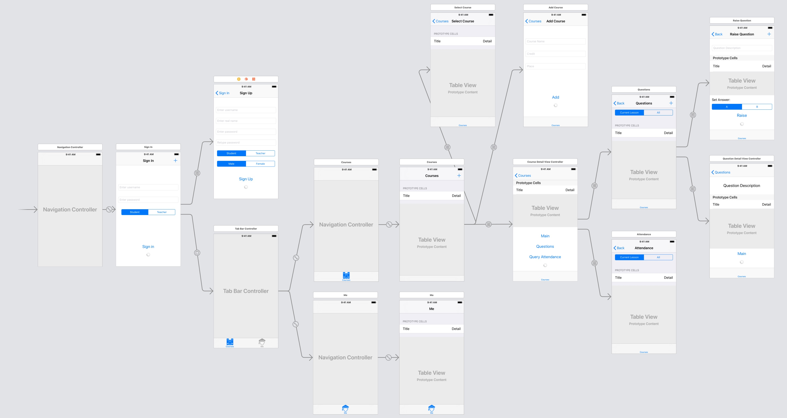

# 客户端代码说明

## 图形界面概览



## 自定义数据结构

考勤系统需要用到的数据结构均定义在 customDataStructure.swift 中。

### 用户

`user` 是一个全局变量，存储了当前登录用户的凭据。可以在任意 ViewController 中访问：

```swift
var user = User("", [:])
```

```swift
class User {
    var id: Int
    var username: String
    var password: String
    var realname: String
    var gender: String // Male or Female
    var type: String   // Student or Teacher
}
```

### 学生

定义学生，`sid` 是其第一无二的标识。

```swift
class Student {
    var sid : Int
    var username : String
    var realname : String
    var gender : String
}
```

### 教师

定义教师，`tid` 是其第一无二的标识。

```swift
class Teacher {
    var tid : Int
    var username : String
    var realname : String
    var gender : String
}
```

### 课程

定义课程，`cid` 是其第一无二的标识。

每个课程（`Course`）有且仅有一个教师（`Teacher`），但有一个或多个课堂（`Lesson`）。每个课堂（`Lesson`）对应一次上课记录，如果 `lessonlist` 为空，则表示该课程到目前还没有上过课。

```swift
class Course {
    var cid: Int
    var teacher: Teacher
    var name: String
    var credit: Int
    var lessonlist: [Lesson]
}
```

### 课堂

定义课堂，`lid` 是其第一无二的标识，`cid` 表示其对应的课程（Course）ID。

如果 `end_time` 为空字符串，代表该课堂正在进行。

```swift
class Lesson {
    var lid: Int
    var cid: Int
    var start_time: String
    var end_time: String
}
```

### 问题

定义问题，`qid` 是其第一无二的标识，`lid` 表示它是在哪一次课堂上提出的。

```swift
class Question {
    var qid: Int
    var lid: Int
    var description: String
    var raised_time: String
    var options: [String]
    var answer: Int
}
``` 

### 签到记录

定义签到记录，记录了某个学生（Student）在某次课堂（Lesson）的签到情况（包括签到时间和状态）。

状态包括四种：

* `Normal`：正常
* `Late`：迟到
* `Leave Early`：早退
* `Absent`：缺勤

```swift
class CheckinRecord {
    var student: Student
    var lesson: Lesson
    var checkin_time: String
    var status: String
}
```

### 回答记录

定义回答记录，记录了某个学生（Student）对某个问题（Question）的作答情况（包括提交时间和选项）。

```swift
class AnswerRecord {
    var student: Student
    var question: Question
    var submit_time: String
    var choice: Int
}
```